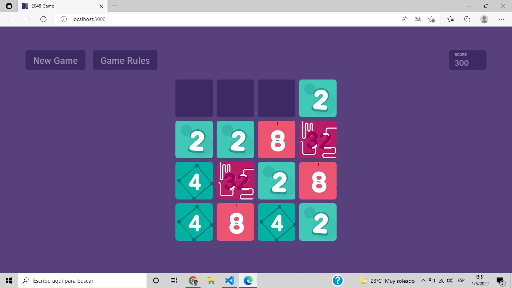

#  🧐 2048 Game

> This is a Game made with react that resembles the 2048 Game and rules, also it has some cool animations.

 

## 🔧 Built With

- HTML
- Sass (.scss extension)
- Using flexbox and CSS grid
- Using mediaqueris for Responsive Design
- .gif files
- React 
- Class based logic (javascript)
- Hooks 

## 🔴 Live Demo

[Live Demo]()


## 🛠 Getting Started

To get a local copy up and running follow these simple example steps.

- Go to the main page of te repo.
- Press the ```Code``` button and get the repo link.
- Clone it using git.
- run ```npm install``` command.

## ✒️ Authors

👤 **Cecilia Benitez**

- [@Ceci007](https://github.com/Ceci007)